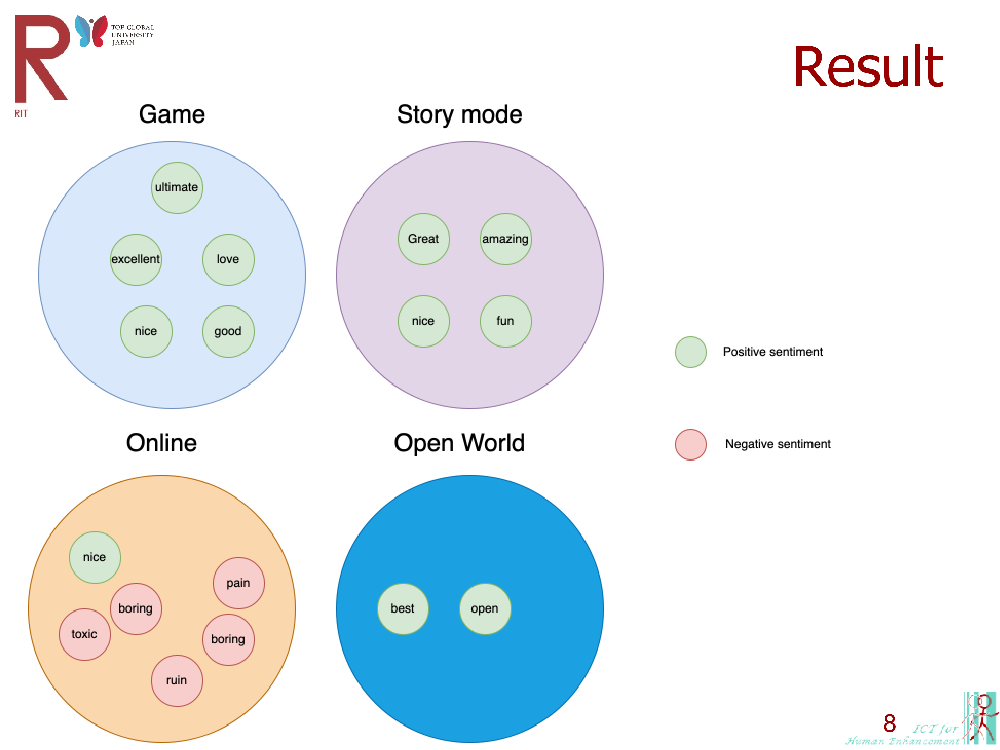

# Aspect-based-Sentiment-Analysis-for-game-comments
This is an analysis about Aspect-based Sentiment analysis for Steam games comments, used Steam API to pull some comments, and return arrays of sentiment related keyword result. This is a simple experient for a Game Recommender System Based on Sentiment Analysis of User Comments (not continue). 

Example result

Presentation Slides

